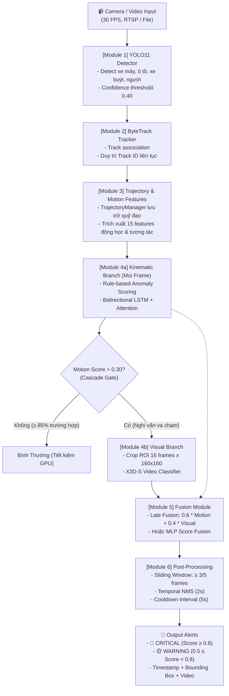

# 🏗️ System Architecture & Design Specification

Tài liệu này mô tả chi tiết kiến trúc kỹ thuật của **Hệ Thống Nhận Diện Tai Nạn Giao Thông Tự Động** (Traffic Accident Detection System).

---

## 1. Sơ Đồ Kiến Trúc Tổng Thể

Hệ thống được thiết kế theo cơ chế **Cascade Multi-Modal Inference**:

---

## 2. Chi Tiết Từng Phân Hệ (Modules)

### Module 1: Object Detection (YOLO11)
- **Model backbone**: YOLO11s (Ultralytics).
- **Lý do lựa chọn**:
  - Cân bằng hoàn hảo giữa tốc độ (real-time 40-60 FPS trên GPU T4) và độ chính xác.
  - Khả năng nhận diện vật thể nhỏ (xe máy ở góc camera CCTV từ xa) vượt trội nhờ kiến trúc C3k2 và SPPF cải tiến.
- **Classes lọc**: 
  - `0`: Person
  - `1`: Bicycle
  - `2`: Car
  - `3`: Motorcycle (Trọng tâm trong giao thông Việt Nam)
  - `5`: Bus
  - `7`: Truck

### Module 2: Multi-Object Tracking (ByteTrack)
- **Cơ chế**: ByteTrack tận dụng cả detection confidence cao và thấp để duy trì track ID khi xe bị che khuất một phần (occlusion).
- **Cấu hình tùy biến cho Việt Nam**:
  - `track_high_thresh: 0.4` (Hạ từ 0.5 để bắt các xe máy nhỏ/xa).
  - `track_buffer: 60` (Lưu vết 2 giây ở 30 fps tránh mất ID khi đổi hướng đột ngột).
  - `match_thresh: 0.8` (Đảm bảo liên kết IoU chính xác).

### Module 3: Motion Feature Extraction & Trajectory Management
Quản lý lịch sử tọa độ tâm và bounding box trong bộ nhớ đệm trượt (sliding window 90 frames).
Đặc trưng 15 chiều cho mỗi cặp đối tượng tương tác:
1. **$v_1^{(x)}, v_1^{(y)}$**: Vận tốc chuẩn hóa đối tượng 1.
2. **$a_1^{(x)}, a_1^{(y)}$**: Gia tốc chuẩn hóa đối tượng 1.
3. **$\Delta\theta_1$**: Góc lệch hướng đột ngột đối tượng 1.
4. **$v_2^{(x)}, v_2^{(y)}$**: Vận tốc chuẩn hóa đối tượng 2.
5. **$a_2^{(x)}, a_2^{(y)}$**: Gia tốc chuẩn hóa đối tượng 2.
6. **$\Delta\theta_2$**: Góc lệch hướng đột ngột đối tượng 2.
7. **$d_{12}$**: Khoảng cách tâm không gian giữa 2 đối tượng.
8. **$\Delta d_{12}$**: Tốc độ hội tụ (tiếp cận) giữa 2 đối tượng.
9. **$\text{IoU}_{12}$**: Độ đè lấn khung hình giữa 2 đối tượng.
10. **$\text{Ratio}_1, \text{Ratio}_2$**: Tỉ lệ biến dạng diện tích (nhận diện xe bị ngã hoặc biến dạng).

### Module 4: Classification Branches
- **Nhánh 4a (Kinematic/Động học)**:
  - *Rule-Based Detector*: Đánh giá 4 quy luật vật lý va chạm (Giảm tốc đột ngột, Đổi hướng gấp, Đè lấn IoU, Tiếp cận siêu tốc).
  - *LSTM Classifier*: Mạng Bidirectional LSTM 2 tầng kèm Temporal Soft-Attention để phân loại chuỗi động học.
- **Nhánh 4b (Visual/Thị giác - X3D-S)**:
  - Chỉ kích hoạt khi Nhánh 4a có `motion_score > 0.30`.
  - Cắt video snippet 16 frame quanh vùng xảy ra tương tác, phân loại bằng X3D-S (~3.8M params) để xác minh va chạm thực tế, loại trừ các trường hợp phanh gấp thông thường.

### Module 5: Multi-Modal Fusion
- Kết hợp điểm số giữa nhánh động học và thị giác:
  $$\text{Score}_{\text{fused}} = w_{\text{motion}} \cdot S_{\text{motion}} + w_{\text{visual}} \cdot S_{\text{visual}}$$
- Ngưỡng cascade: Nếu nhánh thị giác không cần kích hoạt, điểm số là $S_{\text{motion}}$.

### Module 6: Temporal Post-Processing
- **Temporal Sliding Window**: Cần ít nhất 3 trong 5 frame liên tiếp xác nhận va chạm để loại trừ nhiễu giật frame.
- **Temporal NMS**: Gom các cảnh báo trong vòng 2 giây thành 1 sự kiện duy nhất.
- **Alert Cooldown**: Khóa cảnh báo trong 5 giây kế tiếp để tránh lặp cảnh báo cho cùng 1 vụ va chạm.
- **Phân loại cấp độ**:
  - 🔴 **CRITICAL**: Confidence $\ge 0.80$
  - 🟡 **WARNING**: $0.50 \le \text{Confidence} < 0.80$
