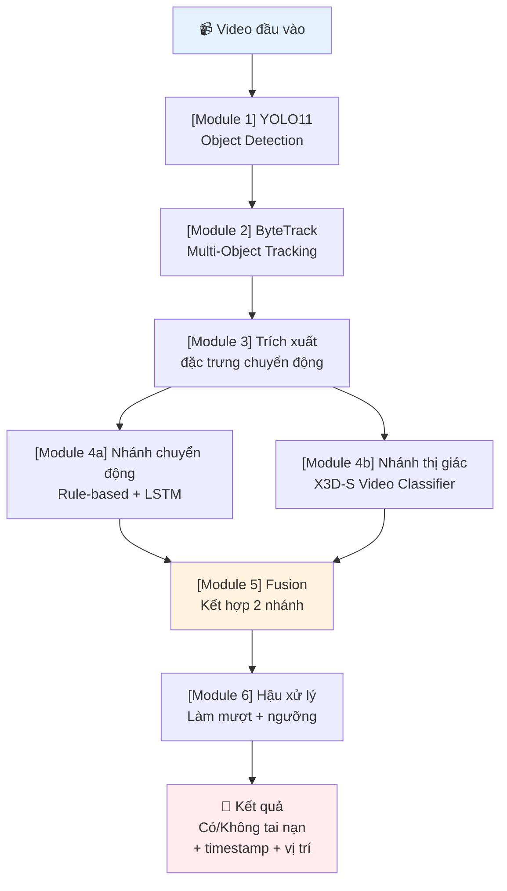
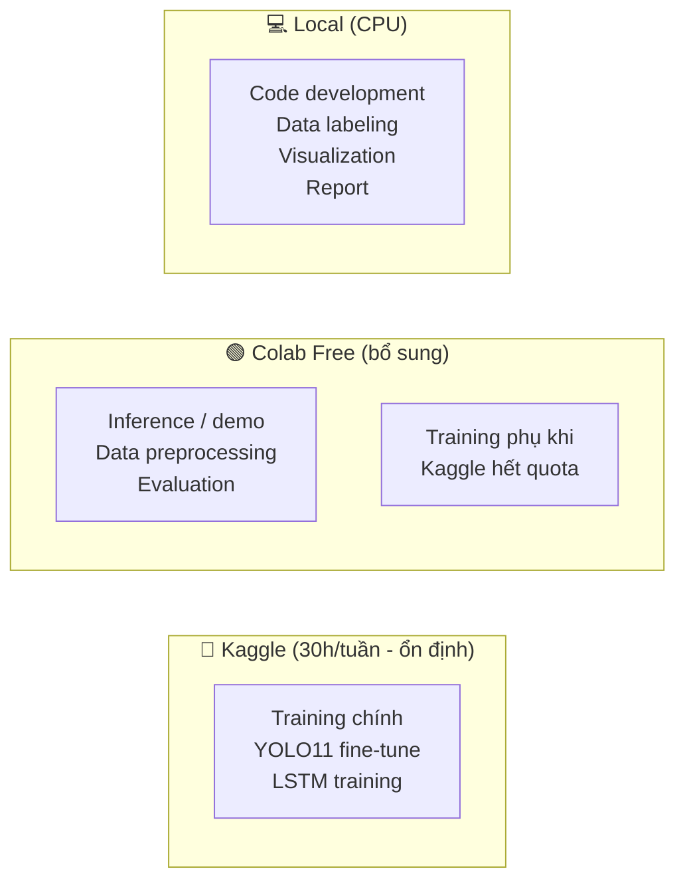
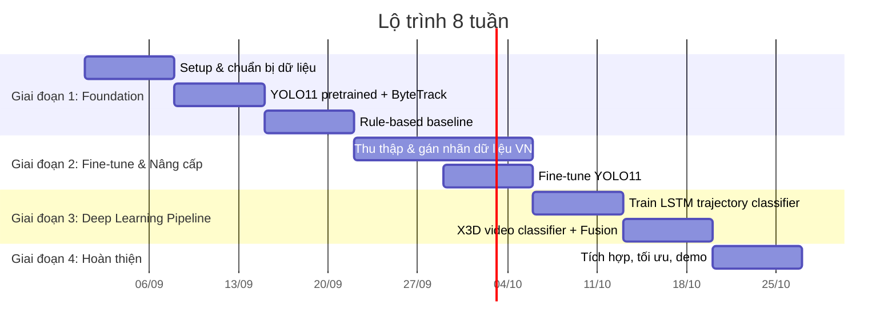
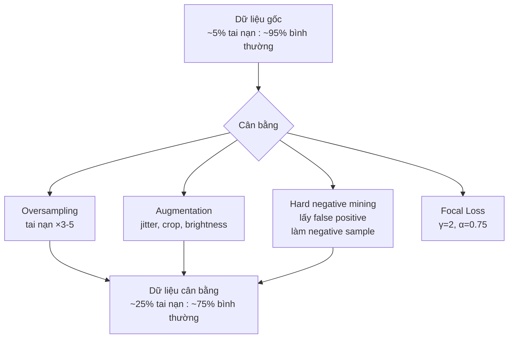
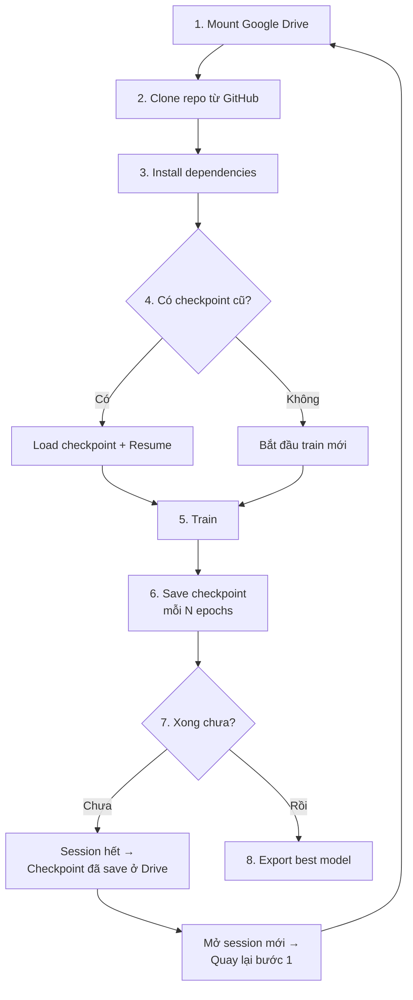
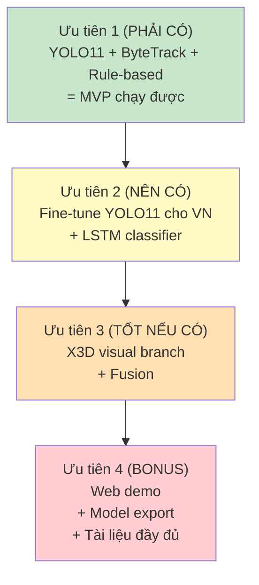

# 🚦 Kế Hoạch Triển Khai Hệ Thống Nhận Diện Tai Nạn Giao Thông Từ Video

> **Thời gian:** 2 tháng (8 tuần — bắt đầu 01/09/2026)
> **Công cụ train:** Google Colab (Free) + Kaggle Notebooks
> **Mô hình detection:** YOLO11 (Ultralytics)
> **Mục tiêu cuối:** Hệ thống pipeline hoàn chỉnh có thể demo trên video thực tế, với khả năng phát hiện tai nạn giao thông và báo cảnh báo kèm timestamp + vị trí.

---

## Mục Lục

1. [Tổng quan kiến trúc](#1-tổng-quan-kiến-trúc)
2. [Ràng buộc tài nguyên & chiến lược xử lý](#2-ràng-buộc-tài-nguyên--chiến-lược-xử-lý)
3. [Lộ trình 8 tuần chi tiết](#3-lộ-trình-8-tuần-chi-tiết)
4. [Chi tiết kỹ thuật từng module](#4-chi-tiết-kỹ-thuật-từng-module)
5. [Quản lý dữ liệu](#5-quản-lý-dữ-liệu)
6. [Chiến lược training trên Colab & Kaggle](#6-chiến-lược-training-trên-colab--kaggle)
7. [Đánh giá & Metrics](#7-đánh-giá--metrics)
8. [Cấu trúc thư mục dự án](#8-cấu-trúc-thư-mục-dự-án)
9. [Rủi ro & phương án dự phòng](#9-rủi-ro--phương-án-dự-phòng)
10. [Checklist hoàn thành](#10-checklist-hoàn-thành)

---

## 1. Tổng Quan Kiến Trúc



### Nguyên tắc thiết kế

| Nguyên tắc | Giải thích |
|---|---|
| **Pipeline có cấu trúc** | Mỗi module độc lập → dễ debug, dễ thay thế từng phần |
| **Cascade inference** | Chỉ kích hoạt nhánh video classifier nặng khi có tín hiệu nghi vấn → tiết kiệm GPU |
| **Incremental development** | Tuần 1-3: baseline rule-based chạy được ngay → sau đó nâng cấp dần |
| **Colab-friendly** | Thiết kế module nhỏ, train từng phần, checkpoint thường xuyên |

---

## 2. Ràng Buộc Tài Nguyên & Chiến Lược Xử Lý

### Giới hạn phần cứng

| Platform | GPU | VRAM | RAM | Session | Quota/tuần |
|---|---|---|---|---|---|
| **Colab Free** | NVIDIA T4 | ~15 GB | ~12 GB | Tối đa 12h (thường bị ngắt sớm hơn) | Không cố định, phụ thuộc demand |
| **Kaggle** | NVIDIA T4 hoặc P100 | 15-16 GB | ~13 GB | Tối đa 12h/session | **30 giờ/tuần** (đảm bảo) |

> [!WARNING]
> **Colab Free không đảm bảo GPU.** Nếu dùng nhiều trong tuần, bạn có thể bị "cooldown" không được cấp GPU trong vài giờ/ngày. Luôn có Kaggle làm backup.

### Chiến lược phân bổ



**Quy tắc vàng:**
1. **Kaggle = nguồn GPU chính** — ưu tiên cho training, luôn dùng hết 30h/tuần
2. **Colab = nguồn bổ sung** — dùng cho inference, evaluation, demo, training phụ
3. **Local = phát triển code** — viết code, test logic, gán nhãn, tạo pipeline
4. **Luôn save checkpoint về Google Drive** — khi session bị ngắt không mất progress

---

## 3. Lộ Trình 8 Tuần Chi Tiết

### Tổng quan timeline



---

### Tuần 1 (01/09 – 07/09): Setup & Chuẩn Bị Dữ Liệu

> **Mục tiêu:** Có môi trường dev sẵn sàng, dữ liệu benchmark tải xong, code skeleton chạy được.

#### Việc cần làm:

**Ngày 1-2: Setup môi trường**
- [ ] Tạo repo Git (GitHub/GitLab) với cấu trúc thư mục chuẩn (xem mục 8)
- [ ] Tạo notebook template cho Colab + Kaggle:
  - Mount Google Drive
  - Install dependencies (`ultralytics`, `pytorch`, `pytorchvideo`, `opencv-python`, `scipy`, `scikit-learn`)
  - Clone repo từ GitHub
  - Load checkpoint từ Drive
- [ ] Setup Google Drive có cấu trúc rõ ràng:
  ```
  MyDrive/
  └── accident_detection/
      ├── datasets/          ← dữ liệu gốc
      ├── checkpoints/       ← model weights
      ├── results/           ← kết quả inference
      ├── logs/              ← training logs
      └── exports/           ← model export
  ```

**Ngày 3-5: Tải & chuẩn bị dữ liệu**
- [ ] Tải dataset DoTA (~55 GB — chia nhỏ tải dần, lưu Google Drive)
  - Source: [github.com/MoonBlvd/Detection-of-Traffic-Anomaly](https://github.com/MoonBlvd/Detection-of-Traffic-Anomaly)
  - 4,677 video, 18 loại anomaly, có annotation spatial-temporal
- [ ] Tải dataset CCD (Car Crash Dataset)
  - Source: [Kaggle - CCD](https://www.kaggle.com/datasets/asmjamil/car-crash-dataset-ccd)
- [ ] Tải dataset CADP (1,416 video CCTV — gần use case nhất)
  - Source: [Roboflow - CADP](https://universe.roboflow.com/yassine-pzpt7/cadp)
- [ ] Viết script tiền xử lý thống nhất format:
  - Trích frame từ video (1-5 FPS tùy dataset)
  - Chuẩn hóa resolution (640×360 hoặc 640×640 cho YOLO)
  - Tạo file annotation mapping (video_id → frames → labels)

**Ngày 6-7: Khám phá dữ liệu (EDA)**
- [ ] Thống kê phân bố: số clip bình thường vs tai nạn, loại xe, thời lượng
- [ ] Visualize vài clip mẫu tai nạn + bình thường
- [ ] Xác định tỉ lệ mất cân bằng → lên kế hoạch cân bằng dữ liệu
- [ ] Viết data loader cơ bản

#### Deliverables tuần 1:
- ✅ Repo Git với code skeleton
- ✅ Notebook template Colab & Kaggle hoạt động
- ✅ Ít nhất 2 dataset (DoTA + CCD hoặc CADP) tải xong
- ✅ EDA report ngắn: phân bố dữ liệu, ảnh mẫu

---

### Tuần 2 (08/09 – 14/09): YOLO11 Pretrained + ByteTrack

> **Mục tiêu:** Detection + Tracking chạy được trên video mẫu, output ra trajectory cơ bản.

#### Việc cần làm:

**Ngày 1-2: Object Detection với YOLO11**
- [ ] Chọn model size phù hợp:

  | Model | Params | mAP (COCO) | Inference Speed | Recommend |
  |---|---|---|---|---|
  | YOLO11n (nano) | ~2.6M | ~39.5 | Rất nhanh | Prototype, edge |
  | **YOLO11s (small)** | ~9.4M | ~47.0 | Nhanh | **Cân bằng tốt nhất** |
  | YOLO11m (medium) | ~20.1M | ~51.5 | Trung bình | Nếu cần accuracy cao |

  → **Khuyến nghị: YOLO11s** — đủ chính xác cho detection, inference nhanh cho real-time, train được trên Colab/Kaggle.

- [ ] Test YOLO11s pretrained (COCO) trên video giao thông mẫu:
  ```python
  from ultralytics import YOLO

  model = YOLO("yolo11s.pt")
  results = model("traffic_video.mp4", save=True, conf=0.4)
  ```
- [ ] Lọc chỉ giữ các class cần thiết: `car, motorcycle, bus, truck, person, bicycle`
- [ ] Đánh giá chất lượng detection trên video VN mẫu (nếu có)

**Ngày 3-4: Multi-Object Tracking với ByteTrack**
- [ ] Kích hoạt tracking ByteTrack:
  ```python
  model = YOLO("yolo11s.pt")
  results = model.track(
      source="traffic_video.mp4",
      persist=True,
      tracker="bytetrack.yaml",
      conf=0.4,
      iou=0.5,
      save=True
  )
  ```
- [ ] Trích xuất thông tin tracking cho từng frame:
  ```python
  for result in results:
      boxes = result.boxes
      if boxes.id is not None:
          track_ids = boxes.id.cpu().numpy()        # ID theo dõi
          bboxes = boxes.xyxy.cpu().numpy()          # [x1, y1, x2, y2]
          classes = boxes.cls.cpu().numpy()           # class ID
          confs = boxes.conf.cpu().numpy()            # confidence
  ```
- [ ] Tinh chỉnh tham số ByteTrack cho giao thông VN:
  - `track_high_thresh`: 0.5 → 0.4 (hạ xuống vì xe máy nhỏ thường có conf thấp)
  - `track_low_thresh`: 0.1 (giữ mặc định)
  - `new_track_thresh`: 0.6 → 0.5
  - `match_thresh`: 0.8 (giữ mặc định)

**Ngày 5-7: Xây dựng module lưu trữ trajectory**
- [ ] Viết class `TrajectoryManager`:
  ```python
  class TrajectoryManager:
      """Quản lý quỹ đạo di chuyển của tất cả object được track."""

      def __init__(self, max_history=90):  # 90 frames ~ 3 giây ở 30fps
          self.tracks = {}      # track_id → list of (frame_id, bbox, class_id, conf)
          self.max_history = max_history

      def update(self, frame_id, track_ids, bboxes, classes, confs):
          """Cập nhật trajectory từ kết quả tracking mỗi frame."""
          ...

      def get_trajectory(self, track_id):
          """Lấy quỹ đạo tâm bbox theo thời gian."""
          ...

      def get_active_tracks(self, min_length=10):
          """Lấy các track đang active có đủ chiều dài tối thiểu."""
          ...

      def cleanup_old_tracks(self, current_frame, max_age=60):
          """Xóa track quá cũ để tiết kiệm bộ nhớ."""
          ...
  ```
- [ ] Test: visualize trajectory trên video (vẽ đường đi của từng xe)
- [ ] Lưu output ra file JSON/CSV để phục vụ các bước sau

#### Deliverables tuần 2:
- ✅ YOLO11s + ByteTrack chạy được trên video mẫu
- ✅ Module `TrajectoryManager` hoàn chỉnh
- ✅ Video demo có bounding box + track ID + đường trajectory
- ✅ Dữ liệu trajectory xuất ra file cho phân tích

---

### Tuần 3 (15/09 – 21/09): Rule-Based Baseline — Phát Hiện Va Chạm

> **Mục tiêu:** Có baseline đầu tiên phát hiện tai nạn bằng luật (rules) trên đặc trưng chuyển động. Đây là MVP.

#### Việc cần làm:

**Ngày 1-3: Module trích xuất đặc trưng chuyển động**
- [ ] Viết class `MotionFeatureExtractor`:

  | Đặc trưng | Công thức | Ý nghĩa |
  |---|---|---|
  | **Vận tốc** | `v(t) = center(t) - center(t-1)` | Tốc độ di chuyển mỗi frame |
  | **Gia tốc** | `a(t) = v(t) - v(t-1)` | Thay đổi vận tốc (giảm tốc đột ngột = nghi vấn) |
  | **Góc lệch hướng** | `θ(t) = arctan2(vy, vx)` rồi `Δθ = θ(t) - θ(t-1)` | Xe bị văng, xoay hướng đột ngột |
  | **IoU chồng lấn** | `IoU(box_a, box_b)` giữa 2 track gần nhau | IoU tăng đột biến = 2 xe chồng lên nhau |
  | **Khoảng cách tương đối** | `d(t) = ‖center_a(t) - center_b(t)‖` | Giảm nhanh bất thường = hội tụ nguy hiểm |
  | **Tỉ lệ diện tích bbox** | `area(t) / area(t-k)` | Thay đổi đột ngột = xe bị biến dạng/lật |

- [ ] Smoothing bằng moving average (window=5) trước khi tính đặc trưng để giảm nhiễu

**Ngày 4-5: Module rule-based detector**
- [ ] Viết class `RuleBasedAccidentDetector`:
  ```python
  class RuleBasedAccidentDetector:
      def __init__(self):
          # Ngưỡng cần tune — giá trị khởi đầu
          self.sudden_decel_thresh = 15.0       # pixel/frame² — giảm tốc đột ngột
          self.direction_change_thresh = 45.0   # độ — thay đổi hướng đột ngột
          self.iou_overlap_thresh = 0.15        # IoU giữa 2 xe tăng trên ngưỡng này
          self.distance_decrease_rate = 0.5     # khoảng cách giảm >50% trong 5 frame
          self.min_track_length = 10            # track quá ngắn → bỏ qua

      def detect(self, trajectories, features) -> list:
          """
          Trả về list các sự kiện nghi vấn:
          [{"frame_range": (f1, f2), "tracks": [id1, id2],
            "score": 0.0-1.0, "reason": "sudden_decel + iou_overlap"}]
          """
          alerts = []
          # Rule 1: Giảm tốc đột ngột
          alerts += self._check_sudden_deceleration(features)
          # Rule 2: Thay đổi hướng đột ngột
          alerts += self._check_direction_change(features)
          # Rule 3: IoU chồng lấn giữa 2 xe
          alerts += self._check_pairwise_iou(trajectories)
          # Rule 4: Khoảng cách hội tụ nhanh
          alerts += self._check_rapid_convergence(trajectories)
          # Kết hợp: nếu nhiều rule cùng kích hoạt → confidence cao hơn
          return self._merge_alerts(alerts)
  ```

**Ngày 5-6: Scoring & merge alerts**
- [ ] Thiết kế hệ thống scoring kết hợp nhiều rule:
  - Mỗi rule vi phạm: +0.25 điểm
  - 2 rule cùng kích hoạt trong cùng khoảng thời gian: nhân hệ số 1.5
  - 3+ rule: nhân hệ số 2.0
  - Ngưỡng cảnh báo: score ≥ 0.5
- [ ] Merge các alert gần nhau (±15 frame) thành 1 sự kiện
- [ ] Áp dụng temporal smoothing: cần ≥ 3 frame liên tiếp có score cao mới trigger

**Ngày 7: Đánh giá baseline**
- [ ] Chạy trên test set (DoTA / CADP)
- [ ] Tính metrics: Precision, Recall, F1, False Alarm Rate/giờ
- [ ] Visualize: video output có highlight vùng nghi vấn + alert
- [ ] Ghi nhận kết quả baseline để so sánh sau

#### Deliverables tuần 3:
- ✅ **MVP hoàn chỉnh**: Video vào → cảnh báo tai nạn ra (rule-based)
- ✅ Module `MotionFeatureExtractor` + `RuleBasedAccidentDetector`
- ✅ Baseline metrics trên ≥1 dataset benchmark
- ✅ Video demo với annotation cảnh báo

> [!IMPORTANT]
> **Checkpoint quan trọng:** Cuối tuần 3 phải có baseline chạy end-to-end. Nếu chậm → ưu tiên việc này trước khi sang giai đoạn 2.

---

### Tuần 4-5 (22/09 – 05/10): Thu Thập & Gán Nhãn Dữ Liệu VN + Fine-tune YOLO11

> **Mục tiêu:** Có dataset giao thông VN gán nhãn, YOLO11 fine-tuned nhận diện tốt xe máy + giao thông hỗn hợp.

#### Tuần 4: Thu thập & gán nhãn dữ liệu

**Thu thập video giao thông VN:**
- [ ] Nguồn video:
  - Camera giám sát thực tế (nếu có quyền truy cập)
  - YouTube: search "camera giao thông Việt Nam", "tai nạn giao thông camera", "CCTV traffic Vietnam"
  - Các kênh báo chí: VTV, VnExpress, Tuổi Trẻ thường đăng clip tai nạn từ camera
- [ ] Mục tiêu thu thập:
  - **50-100 clip tai nạn** (mỗi clip 10-30 giây)
  - **200-300 clip bình thường** (đa dạng: ban ngày/đêm, mưa/nắng, đông/vắng)
  - Ưu tiên: giao lộ, đường 2 chiều, có xe máy mật độ cao

**Gán nhãn detection (bounding box):**
- [ ] Sử dụng **Roboflow** (free tier: 10,000 ảnh) hoặc **CVAT** (open-source, chạy local):
  - Gán nhãn 6 class: `car`, `motorcycle`, `truck`, `bus`, `person`, `bicycle`
  - Mục tiêu: **2,000-3,000 ảnh** gán nhãn (trích ~10 frame/clip × 200+ clip)
- [ ] Augmentation trong Roboflow:
  - Flip ngang
  - Brightness ±15%
  - Blur nhẹ (simulate camera chất lượng thấp)
  - Crop ±10%
- [ ] Export format YOLO (txt annotation)

**Gán nhãn accident (video-level):**
- [ ] Label đơn giản cho mỗi clip: `accident` / `normal`
- [ ] Với clip accident: ghi thêm frame bắt đầu + frame kết thúc sự kiện
- [ ] Lưu vào CSV: `video_name, label, start_frame, end_frame, description`

> [!TIP]
> **Mẹo gán nhãn hiệu quả:**
> - Dùng Roboflow's Smart Labeling (auto-assist) để tăng tốc gán bbox
> - Chia nhỏ công việc: mỗi ngày gán ~100-150 ảnh (30-45 phút)
> - Ưu tiên gán nhãn `motorcycle` kỹ vì đây là class quan trọng nhất cho VN

#### Tuần 5: Fine-tune YOLO11

**Chuẩn bị data fine-tune:**
- [ ] Kết hợp dữ liệu:
  - Dữ liệu VN tự gán nhãn (2,000-3,000 ảnh)
  - Subset từ COCO (chọn ảnh có class vehicle — ~5,000 ảnh)
  - Tổng: ~7,000-8,000 ảnh
- [ ] Chia train/val: 85% / 15%
- [ ] Tạo file `data.yaml`:
  ```yaml
  path: /content/drive/MyDrive/accident_detection/datasets/vn_traffic
  train: images/train
  val: images/val
  nc: 6
  names: ['car', 'motorcycle', 'truck', 'bus', 'person', 'bicycle']
  ```

**Training trên Kaggle (ưu tiên) + Colab:**
- [ ] Config training:
  ```python
  from ultralytics import YOLO

  model = YOLO("yolo11s.pt")  # pretrained COCO

  results = model.train(
      data="data.yaml",
      epochs=100,           # target: 80-100 epochs
      imgsz=640,
      batch=16,             # điều chỉnh theo VRAM, T4 thường chạy 16 ok
      patience=15,          # early stopping
      optimizer="AdamW",
      lr0=0.001,            # lower LR vì fine-tune
      lrf=0.01,
      warmup_epochs=3,
      save_period=10,       # save checkpoint mỗi 10 epoch
      project="/content/drive/MyDrive/accident_detection/checkpoints",
      name="yolo11s_vn_traffic",
      resume=True,          # ← QUAN TRỌNG: resume khi session bị ngắt
  )
  ```
- [ ] Chiến lược chia session training:
  - Kaggle session 1 (8-10h): epoch 1-40
  - Kaggle session 2 (8-10h): epoch 41-80 (resume từ checkpoint)
  - Colab backup: epoch 81-100 nếu cần

**Đánh giá sau fine-tune:**
- [ ] So sánh mAP@0.5 trên val set:
  - YOLO11s pretrained (COCO gốc) → trên video VN
  - YOLO11s fine-tuned → trên video VN
- [ ] Kiểm tra đặc biệt: detection motorcycle ở mật độ cao, xe nhỏ/xa camera
- [ ] Chạy lại baseline rule-based với model detection mới → so sánh metrics

#### Deliverables tuần 4-5:
- ✅ Dataset VN: 2,000+ ảnh detection label + 250+ clip accident/normal label
- ✅ YOLO11s fine-tuned, mAP cải thiện so với pretrained trên dữ liệu VN
- ✅ Pipeline detection + tracking cải thiện trên video VN
- ✅ Baseline metrics cập nhật

---

### Tuần 6 (06/10 – 12/10): LSTM/GRU Trajectory Classifier

> **Mục tiêu:** Thay thế rule-based bằng mạng LSTM học trên chuỗi đặc trưng chuyển động → phát hiện pattern tai nạn phức tạp hơn rules.

#### Chuẩn bị dữ liệu training cho LSTM

- [ ] Từ các video đã có label (DoTA + CADP + dữ liệu VN):
  1. Chạy YOLO11 fine-tuned + ByteTrack trên mỗi video
  2. Trích xuất chuỗi đặc trưng chuyển động (Module 3) cho mỗi cặp track gần nhau
  3. Tạo sample: `(sequence_features, label)` — sequence dài 30-60 frame

- [ ] Feature vector cho mỗi timestep (cho 1 cặp track):
  ```
  [v1_x, v1_y, a1_x, a1_y, Δθ1,        ← track 1: vận tốc, gia tốc, góc lệch
   v2_x, v2_y, a2_x, a2_y, Δθ2,        ← track 2
   distance, Δdistance, iou,             ← quan hệ giữa 2 track
   area_ratio_1, area_ratio_2]           ← thay đổi diện tích
  = 15 features / timestep
  ```

- [ ] Cân bằng dữ liệu:
  - Oversampling clip tai nạn (×3-5)
  - Random crop negative samples từ clip bình thường
  - Augmentation: jitter thời gian (shift ±2 frame), scale features ±10%

#### Kiến trúc LSTM

```python
class TrajectoryAccidentClassifier(nn.Module):
    def __init__(self, input_dim=15, hidden_dim=64, num_layers=2, dropout=0.3):
        super().__init__()
        self.lstm = nn.LSTM(
            input_dim, hidden_dim,
            num_layers=num_layers,
            batch_first=True,
            dropout=dropout,
            bidirectional=True    # nhìn cả trước và sau
        )
        self.attention = nn.Sequential(
            nn.Linear(hidden_dim * 2, 1),
            nn.Softmax(dim=1)
        )
        self.classifier = nn.Sequential(
            nn.Linear(hidden_dim * 2, 32),
            nn.ReLU(),
            nn.Dropout(0.3),
            nn.Linear(32, 1),
            nn.Sigmoid()
        )

    def forward(self, x):
        # x: (batch, seq_len, input_dim)
        lstm_out, _ = self.lstm(x)           # (batch, seq_len, hidden*2)
        attn_weights = self.attention(lstm_out)  # (batch, seq_len, 1)
        context = (lstm_out * attn_weights).sum(dim=1)  # (batch, hidden*2)
        return self.classifier(context)       # (batch, 1)
```

#### Training config

- [ ] Training trên Kaggle:
  - Loss: **Focal Loss** (γ=2, α=0.75) — xử lý mất cân bằng
  - Optimizer: AdamW, lr=1e-3
  - Batch size: 64-128 (LSTM nhẹ, không tốn VRAM)
  - Epochs: 50-100 (early stopping patience=10)
  - Ước tính thời gian: 1-2 giờ training (rất nhẹ)

- [ ] Đánh giá:
  - So sánh LSTM vs rule-based trên cùng test set
  - Phân tích confusion matrix: false positive & false negative
  - Tune threshold trên validation set

#### Deliverables tuần 6:
- ✅ LSTM trajectory classifier trained
- ✅ So sánh LSTM vs Rule-based: metrics cải thiện
- ✅ Pipeline cập nhật: Detection → Tracking → Features → LSTM → Alert

---

### Tuần 7 (13/10 – 19/10): X3D Video Classifier + Fusion

> **Mục tiêu:** Thêm nhánh thị giác (visual branch) và kết hợp với nhánh chuyển động để giảm false positive.

#### Nhánh thị giác — X3D-S

**Tại sao X3D-S?**
- Nhẹ nhất trong họ X3D (~3.8M params, ~0.6 GFLOPs)
- Đủ mạnh cho task binary classification (accident vs normal)
- Fit vào T4 15GB VRAM với batch nhỏ
- Pretrained Kinetics-400

**Chuẩn bị dữ liệu clip:**
- [ ] Từ video đã chạy qua pipeline → lấy vùng ROI (crop quanh bbox nghi vấn):
  - Khi nhánh chuyển động trigger alert → crop clip 2-4 giây quanh thời điểm đó
  - Resize clip: 160×160 hoặc 182×182 (chuẩn X3D-S)
  - Sample 16 frame / clip (cách đều)
- [ ] Dataset clip:
  - Positive: crop từ vùng tai nạn (từ DoTA/CADP/VN data)
  - Negative: crop ngẫu nhiên từ video bình thường + false positive của baseline
  - Mục tiêu: 1,000-2,000 clip positive, 3,000-5,000 clip negative

**Fine-tune X3D-S:**
```python
import torch
from pytorchvideo.models import create_x3d

# Load pretrained X3D-S
model = torch.hub.load('facebookresearch/pytorchvideo', 'x3d_s', pretrained=True)

# Thay head → binary classification
model.blocks[5].proj = nn.Linear(2048, 1)  # accident probability

# Freeze backbone, chỉ train head + 2 block cuối
for name, param in model.named_parameters():
    if 'blocks.5' not in name and 'blocks.4' not in name:
        param.requires_grad = False
```

- [ ] Training config:
  - Loss: Focal Loss
  - Optimizer: AdamW, lr=1e-4 (nhỏ vì fine-tune)
  - Batch size: 8-12 (video model tốn VRAM)
  - Epochs: 20-30
  - Ước tính: 4-6 giờ trên Kaggle T4

#### Module Fusion

- [ ] Thiết kế fusion đơn giản nhưng hiệu quả:
  ```python
  class AccidentFusion(nn.Module):
      def __init__(self):
          super().__init__()
          # Weighted combination
          self.motion_weight = nn.Parameter(torch.tensor(0.6))
          self.visual_weight = nn.Parameter(torch.tensor(0.4))
          # Hoặc MLP fusion
          self.fusion_mlp = nn.Sequential(
              nn.Linear(2, 16),
              nn.ReLU(),
              nn.Linear(16, 1),
              nn.Sigmoid()
          )

      def forward(self, motion_score, visual_score):
          combined = torch.stack([motion_score, visual_score], dim=-1)
          return self.fusion_mlp(combined)
  ```

- [ ] Chiến lược fusion thực tế (inference):
  ```
  Bước 1: Chạy Detection + Tracking + Feature Extraction (mọi frame)
  Bước 2: Nhánh chuyển động (LSTM) → motion_score
  Bước 3: NẾU motion_score > 0.3 (ngưỡng thấp):
          → Crop ROI clip → chạy X3D-S → visual_score
          → final_score = fusion(motion_score, visual_score)
  Bước 4: NẾU motion_score ≤ 0.3 → bỏ qua (không tốn tài nguyên X3D)
  ```

  > Cascade inference: chỉ chạy X3D khi có nghi vấn → tiết kiệm 80-90% computation.

#### Deliverables tuần 7:
- ✅ X3D-S fine-tuned trên clip accident/normal
- ✅ Fusion module kết hợp 2 nhánh
- ✅ Pipeline hoàn chỉnh 6 module
- ✅ So sánh: Baseline → LSTM-only → LSTM + X3D fusion

---

### Tuần 8 (20/10 – 26/10): Tích Hợp, Tối Ưu, Demo, Tài Liệu

> **Mục tiêu:** Hoàn thiện pipeline end-to-end, tối ưu, tạo demo, viết tài liệu.

#### Tích hợp pipeline hoàn chỉnh

- [ ] Viết class `AccidentDetectionPipeline` — orchestrator chính:
  ```python
  class AccidentDetectionPipeline:
      def __init__(self, config):
          self.detector = YOLO(config.yolo_weights)
          self.tracker_config = config.tracker_yaml
          self.trajectory_manager = TrajectoryManager()
          self.feature_extractor = MotionFeatureExtractor()
          self.motion_classifier = TrajectoryAccidentClassifier.load(config.lstm_weights)
          self.visual_classifier = load_x3d(config.x3d_weights)
          self.fusion = AccidentFusion.load(config.fusion_weights)
          self.post_processor = PostProcessor(config)

      def process_video(self, video_path, output_path=None):
          """Xử lý 1 video từ đầu đến cuối, trả về list các sự kiện tai nạn."""
          ...

      def process_stream(self, rtsp_url):
          """Xử lý video stream real-time (cho camera CCTV)."""
          ...
  ```

#### Hậu xử lý (Post-processing)

- [ ] Module `PostProcessor`:
  - **Temporal smoothing**: dùng sliding window (5 frame), chỉ alert khi ≥ 3/5 frame đều có score cao
  - **Non-maximum suppression theo thời gian**: merge các alert trong khoảng 2 giây thành 1 sự kiện
  - **Ngưỡng đa cấp**:
    - Score ≥ 0.8: 🔴 Alert cao — chắc chắn tai nạn
    - Score 0.5-0.8: 🟡 Warning — cần xác nhận
    - Score < 0.5: bỏ qua
  - **Cooldown**: sau khi phát 1 alert, chờ 5 giây trước khi phát alert tiếp (tránh spam)

#### Tối ưu hiệu năng

- [ ] **Model export**: convert YOLO11 sang TensorRT/ONNX cho inference nhanh hơn:
  ```python
  model = YOLO("yolo11s_finetuned.pt")
  model.export(format="onnx", imgsz=640, half=True)
  ```
- [ ] **Batch inference**: xử lý 2-4 frame cùng lúc nếu GPU đủ VRAM
- [ ] **Skip frames**: chỉ chạy detection ở 10-15 FPS thay vì full 30 FPS
- [ ] Benchmark: đo FPS trên T4, tính toán khả năng xử lý bao nhiêu luồng camera

#### Tạo demo

- [ ] **Demo script**: nhận video input → output video annotated + JSON kết quả
- [ ] **Gradio/Streamlit web app** (chạy trên Colab):
  ```python
  import gradio as gr

  def detect_accidents(video):
      pipeline = AccidentDetectionPipeline(config)
      results = pipeline.process_video(video)
      # Return annotated video + results summary
      return annotated_video, results_json

  demo = gr.Interface(
      fn=detect_accidents,
      inputs=gr.Video(),
      outputs=[gr.Video(), gr.JSON()],
      title="🚦 Traffic Accident Detection System"
  )
  demo.launch(share=True)
  ```
- [ ] Quay video demo trên 3-5 clip tiêu biểu (có tai nạn + bình thường)

#### Viết tài liệu

- [ ] README.md chi tiết
- [ ] Báo cáo kết quả: bảng so sánh metrics qua từng giai đoạn
- [ ] Hướng dẫn reproduce: setup → train → inference
- [ ] Hạn chế và hướng phát triển

#### Deliverables tuần 8:
- ✅ Pipeline hoàn chỉnh đóng gói
- ✅ Demo web app chạy được
- ✅ Tài liệu đầy đủ
- ✅ Báo cáo metrics tổng kết

---

## 4. Chi Tiết Kỹ Thuật Từng Module

### Module 1: Object Detection (YOLO11)

| Thông số | Giá trị |
|---|---|
| Model | YOLO11s (Small) |
| Input size | 640 × 640 |
| Classes | car, motorcycle, truck, bus, person, bicycle |
| Confidence threshold | 0.4 (inference) |
| NMS IoU threshold | 0.5 |
| Framework | Ultralytics |

**Lưu ý cho bối cảnh VN:**
- Xe máy chiếm 60-80% phương tiện → đây là class quan trọng nhất
- Xe máy thường nhỏ trong frame CCTV → cần `imgsz` đủ lớn (640+)
- Mật độ cao → NMS IoU threshold nên đặt 0.45-0.5 (không quá thấp)

### Module 2: Multi-Object Tracking (ByteTrack)

| Thông số | Giá trị | Ghi chú |
|---|---|---|
| Tracker | ByteTrack | Tích hợp sẵn Ultralytics |
| `track_high_thresh` | 0.4 | Hạ từ 0.5 cho xe nhỏ |
| `track_low_thresh` | 0.1 | Giữ mặc định |
| `new_track_thresh` | 0.5 | |
| `track_buffer` | 60 | Frame buffer giữ track khi mất |
| `match_thresh` | 0.8 | |

### Module 3: Motion Feature Extraction

Đặc trưng được chuẩn hóa (normalize) theo kích thước frame để không phụ thuộc resolution:
```
center_x_norm = center_x / frame_width
center_y_norm = center_y / frame_height
velocity_norm = velocity / diagonal_length
```

### Module 4a: LSTM Trajectory Classifier

| Thông số | Giá trị |
|---|---|
| Input dim | 15 features/timestep |
| Sequence length | 30-60 frames |
| Hidden dim | 64 |
| Layers | 2 (bidirectional) |
| Dropout | 0.3 |
| Attention | Soft attention |
| Params | ~100K (rất nhẹ) |

### Module 4b: X3D-S Video Classifier

| Thông số | Giá trị |
|---|---|
| Architecture | X3D-S (pretrained Kinetics-400) |
| Input | 16 frames × 160 × 160 |
| Fine-tune layers | Block 4 + Block 5 (head) |
| Output | 1 (sigmoid → accident probability) |
| Params | ~3.8M |

### Module 5: Fusion

| Chiến lược | Chi tiết |
|---|---|
| Kiểu fusion | Late fusion (score-level) |
| Input | motion_score (từ LSTM) + visual_score (từ X3D) |
| Cascade | Chỉ kích hoạt X3D khi motion_score > 0.3 |
| Fusion method | MLP 2 → 16 → 1 hoặc weighted average |

### Module 6: Post-processing

| Thông số | Giá trị |
|---|---|
| Temporal window | 5 frames |
| Min consecutive alerts | 3/5 frames |
| NMS temporal | 2 giây |
| Alert levels | 🔴 ≥ 0.8 / 🟡 0.5-0.8 |
| Cooldown | 5 giây |

---

## 5. Quản Lý Dữ Liệu

### Tổng hợp dataset

| Dataset | Loại | Số lượng | Góc camera | Dùng cho |
|---|---|---|---|---|
| **DoTA** | Dashcam anomaly | 4,677 video | Egocentric | Pretrain anomaly detection |
| **CCD** | Dashcam crash | ~6,000 video | Egocentric | Train accident recognition |
| **CADP** | CCTV accident | 1,416 video | Fixed | **Gần use case nhất** |
| **Tự thu thập VN** | Hỗn hợp | 250-400 clip | Hỗn hợp | Fine-tune cho VN |

### Xử lý mất cân bằng dữ liệu



> [!CAUTION]
> **Không nên oversample đến 50:50** — trong thực tế tai nạn rất hiếm, model cần biết điều này. Tỉ lệ 20-30% accident trong training set là hợp lý.

### Lưu trữ trên Google Drive

```
MyDrive/accident_detection/
├── datasets/
│   ├── dota/                    ← 55GB (tải dần)
│   │   ├── videos/
│   │   ├── annotations/
│   │   └── splits/
│   ├── ccd/
│   ├── cadp/
│   ├── vn_traffic/              ← dữ liệu tự thu thập
│   │   ├── images/
│   │   │   ├── train/
│   │   │   └── val/
│   │   ├── labels/
│   │   │   ├── train/
│   │   │   └── val/
│   │   ├── videos/
│   │   │   ├── accident/
│   │   │   └── normal/
│   │   └── data.yaml
│   └── trajectory_features/     ← đặc trưng trích xuất
│       ├── train/
│       └── val/
├── checkpoints/
│   ├── yolo11s_vn_traffic/
│   ├── lstm_trajectory/
│   ├── x3d_accident/
│   └── fusion/
├── results/
│   ├── baseline_rules/
│   ├── lstm_only/
│   └── full_pipeline/
└── logs/
```

---

## 6. Chiến Lược Training Trên Colab & Kaggle

### Quy trình training chuẩn (áp dụng cho mọi module)



### Template notebook chuẩn

```python
# ========================================
# CELL 1: Setup (chạy đầu tiên mỗi session)
# ========================================
from google.colab import drive
drive.mount('/content/drive')

!pip install -q ultralytics pytorchvideo

# Clone repo
!git clone https://github.com/YOUR_REPO/accident-detection.git
%cd accident-detection
!git pull origin main

# Paths
DRIVE_BASE = "/content/drive/MyDrive/accident_detection"
CHECKPOINT_DIR = f"{DRIVE_BASE}/checkpoints"
DATA_DIR = f"{DRIVE_BASE}/datasets"

import os
os.makedirs(CHECKPOINT_DIR, exist_ok=True)

# ========================================
# CELL 2: Check GPU
# ========================================
import torch
print(f"GPU: {torch.cuda.get_device_name(0)}")
print(f"VRAM: {torch.cuda.get_device_properties(0).total_mem / 1e9:.1f} GB")

# ========================================
# CELL 3: Training (specific to each module)
# ========================================
# ... (module-specific training code)

# ========================================
# CELL 4: Save checkpoint (chạy định kỳ hoặc khi sắp hết session)
# ========================================
import shutil
# Copy best weights to Drive
shutil.copy("runs/detect/train/weights/best.pt",
            f"{CHECKPOINT_DIR}/yolo11s_vn_best.pt")
print("✅ Checkpoint saved to Drive!")
```

### Phân bổ GPU quota theo tuần

| Tuần | Kaggle (30h) | Colab (bổ sung) | Nội dung training |
|---|---|---|---|
| 1 | 0h | 2-3h | EDA, test inference |
| 2 | 5h | 3h | Test detection + tracking |
| 3 | 5h | 3h | Chạy baseline, evaluation |
| 4 | 2h | 2h | Preprocessing data |
| **5** | **20h** | **8h** | **YOLO11 fine-tune** (quan trọng nhất) |
| **6** | **5h** | **2h** | **LSTM training** (nhẹ) |
| **7** | **20h** | **8h** | **X3D fine-tune + Fusion** |
| 8 | 10h | 5h | Final eval, export, demo |

> [!TIP]
> **Mẹo tối ưu GPU Kaggle:**
> - Dùng "Accelerator: GPU T4 ×2" nếu available
> - Commit notebook để chạy background (không cần giữ tab mở)
> - Save output dataset lên Kaggle Datasets → load lại nhanh hơn Drive

---

## 7. Đánh Giá & Metrics

### Metrics chính

| Metric | Mô tả | Target |
|---|---|---|
| **Precision** | Trong các alert đưa ra, bao nhiêu % đúng | ≥ 70% |
| **Recall** | Trong tổng tai nạn thật, phát hiện được bao nhiêu % | ≥ 80% |
| **F1-Score** | Trung bình harmonic P & R | ≥ 0.75 |
| **FAR/h** | False Alarm Rate per Hour — số báo giả mỗi giờ | ≤ 2 |
| **Detection Latency** | Thời gian từ lúc xảy ra → phát hiện | ≤ 3 giây |
| **FPS** | Tốc độ xử lý | ≥ 15 FPS (real-time) |

### Bảng so sánh qua từng giai đoạn (mẫu)

| Giai đoạn | Method | Precision | Recall | F1 | FAR/h | Note |
|---|---|---|---|---|---|---|
| Tuần 3 | Rule-based | ? | ? | ? | ? | Baseline |
| Tuần 6 | LSTM-only | ? | ? | ? | ? | vs baseline |
| Tuần 7 | LSTM + X3D fusion | ? | ? | ? | ? | Full pipeline |

> Điền kết quả thực tế vào đây khi đánh giá.

### Cách đánh giá

1. **Video-level**: mỗi video → predict có/không tai nạn → so với ground truth
2. **Temporal IoU**: nếu predict đúng video, kiểm tra thêm timestamp ±2 giây có trùng ground truth không
3. **False Alarm Rate**: chạy 10+ giờ video bình thường liên tục, đếm số alert sai

---

## 8. Cấu Trúc Thư Mục Dự Án

```
accident-detection/
├── README.md
├── requirements.txt
├── setup.py
├── configs/
│   ├── default.yaml              ← cấu hình mặc định pipeline
│   ├── bytetrack_custom.yaml     ← tham số ByteTrack tùy chỉnh
│   └── data.yaml                 ← config dữ liệu YOLO
├── src/
│   ├── __init__.py
│   ├── pipeline.py               ← AccidentDetectionPipeline (orchestrator)
│   ├── detection/
│   │   ├── __init__.py
│   │   └── yolo_detector.py      ← wrapper YOLO11
│   ├── tracking/
│   │   ├── __init__.py
│   │   └── trajectory_manager.py ← TrajectoryManager
│   ├── features/
│   │   ├── __init__.py
│   │   └── motion_features.py    ← MotionFeatureExtractor
│   ├── classifiers/
│   │   ├── __init__.py
│   │   ├── rule_based.py         ← RuleBasedAccidentDetector
│   │   ├── lstm_classifier.py    ← TrajectoryAccidentClassifier
│   │   └── video_classifier.py   ← X3D wrapper
│   ├── fusion/
│   │   ├── __init__.py
│   │   └── fusion.py             ← AccidentFusion
│   └── postprocessing/
│       ├── __init__.py
│       └── post_processor.py     ← PostProcessor
├── notebooks/
│   ├── 01_eda.ipynb
│   ├── 02_detection_tracking.ipynb
│   ├── 03_baseline_rules.ipynb
│   ├── 04_yolo_finetune.ipynb     ← Kaggle notebook
│   ├── 05_lstm_training.ipynb     ← Kaggle notebook
│   ├── 06_x3d_finetune.ipynb     ← Kaggle notebook
│   ├── 07_fusion_training.ipynb
│   └── 08_demo.ipynb
├── scripts/
│   ├── download_datasets.py
│   ├── preprocess_data.py
│   ├── extract_features.py
│   ├── evaluate.py
│   └── export_model.py
├── tests/
│   ├── test_detection.py
│   ├── test_tracking.py
│   ├── test_features.py
│   └── test_pipeline.py
├── demo/
│   ├── app.py                     ← Gradio demo
│   └── sample_videos/
└── docs/
    ├── architecture.md
    ├── training_guide.md
    └── results_report.md
```

---

## 9. Rủi Ro & Phương Án Dự Phòng

| # | Rủi ro | Xác suất | Ảnh hưởng | Phương án dự phòng |
|---|---|---|---|---|
| 1 | **Colab/Kaggle hết GPU giữa chừng** | Cao | Trễ training | Luôn save checkpoint mỗi 5-10 epoch. Xen kẽ Colab ↔ Kaggle. Chia training thành session 4-6h. |
| 2 | **DoTA dataset quá lớn (55GB) tải lâu** | Trung bình | Trễ tuần 1 | Tải ưu tiên subset nhỏ (1,000 video). Dùng CCD + CADP (nhỏ hơn) trước. |
| 3 | **YOLO11 detection kém trên xe máy VN** | Cao | Giảm accuracy | Fine-tune sớm (tuần 5). Tự gán nhãn thêm ảnh xe máy. Hạ confidence threshold. |
| 4 | **False positive quá cao** | Trung bình | Hệ thống không dùng được | Thêm hard negative mining. Tăng ngưỡng. Thêm nhánh X3D xác nhận. |
| 5 | **X3D tốn VRAM quá, không train được trên T4** | Thấp | Thiếu nhánh visual | Giảm batch size xuống 4. Dùng X3D-XS (nhỏ hơn). Hoặc bỏ qua, chỉ dùng LSTM. |
| 6 | **Thời gian 2 tháng không đủ** | Trung bình | Không hoàn thành | Ưu tiên: Module 1-4a (LSTM) xong là có sản phẩm dùng được. Module 4b-5 là bonus. |

### Kế hoạch ưu tiên nếu thiếu thời gian



> [!IMPORTANT]
> **Nguyên tắc:** Nếu bị trễ, cắt từ dưới lên. MVP (YOLO11 + ByteTrack + Rules) phải xong trước tuần 4. Mọi thứ sau đó là cải thiện.

---

## 10. Checklist Hoàn Thành

### Cuối tuần 3 (MVP Checkpoint) ✨

- [ ] Detection + Tracking chạy được trên video
- [ ] Rule-based accident detection có output
- [ ] Baseline metrics đo trên ≥1 dataset
- [ ] Video demo baseline

### Cuối tuần 5 (Fine-tune Checkpoint)

- [ ] Dataset VN thu thập + gán nhãn xong
- [ ] YOLO11 fine-tuned, cải thiện detection trên video VN
- [ ] Pipeline cập nhật metrics

### Cuối tuần 8 (Final Delivery) 🎯

- [ ] Pipeline hoàn chỉnh 6 module (hoặc tối thiểu 4 module nếu thiếu thời gian)
- [ ] LSTM trajectory classifier trained
- [ ] (Optional) X3D visual classifier + fusion
- [ ] Bảng so sánh metrics qua các giai đoạn
- [ ] Demo app hoặc script chạy được
- [ ] README + tài liệu hướng dẫn
- [ ] Code clean, có test cơ bản
- [ ] Tất cả model weights lưu trên Google Drive

---

## Phụ Lục: Dependencies

```txt
# requirements.txt
ultralytics>=8.3.0        # YOLO11 + ByteTrack
torch>=2.1.0
torchvision>=0.16.0
pytorchvideo>=0.1.5       # X3D model
opencv-python>=4.8.0
numpy>=1.24.0
scipy>=1.11.0
scikit-learn>=1.3.0
pandas>=2.1.0
matplotlib>=3.7.0
seaborn>=0.12.0
gradio>=4.0.0             # demo web app
pyyaml>=6.0
tqdm>=4.65.0
tensorboard>=2.14.0       # training visualization
focal-loss-torch>=0.0.7   # focal loss implementation
```

> [!NOTE]
> Versions có thể cần cập nhật theo thời điểm bạn bắt đầu. Luôn dùng phiên bản mới nhất ổn định.

---

*Tài liệu này được cập nhật lần cuối: 01/09/2026. Bản quyền: Dự án nội bộ.*
