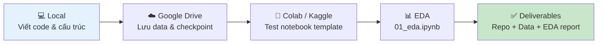

# Tuần 1: Setup Môi Trường & Chuẩn Bị Dữ Liệu

> **Thời gian:** 01/09 – 07/09/2026  
> **Mục tiêu:** Có môi trường dev sẵn sàng, dữ liệu benchmark tải xong, code skeleton chạy được.  
> **GPU dùng:** ~2–3h Colab (EDA, test nhẹ) — không cần Kaggle nhiều tuần này.

---

## Tổng Quan



---

## Cấu Trúc File Tuần Này

| File / Thư mục | Mô tả |
|---|---|
| [`notebooks/00_template_colab_kaggle.ipynb`](../notebooks/00_template_colab_kaggle.ipynb) | Template notebook chuẩn cho mọi session Colab/Kaggle |
| [`notebooks/01_eda.ipynb`](../notebooks/01_eda.ipynb) | Notebook phân tích khám phá dữ liệu (EDA) |
| [`scripts/download_datasets.py`](../scripts/download_datasets.py) | Script khởi tạo cấu trúc thư mục dataset |
| [`scripts/preprocess_data.py`](../scripts/preprocess_data.py) | Script trích frame từ video |
| [`configs/default.yaml`](../configs/default.yaml) | Cấu hình mặc định toàn bộ pipeline |

---

## Ngày 1–2: Setup Môi Trường

### Bước 1: Tạo Repo Git

1. Vào [github.com](https://github.com) → **New repository**
2. Đặt tên: `traffic-accident-detection` (hoặc tùy chọn)
3. Chọn **Private** nếu cần bảo mật, **Public** nếu muốn chia sẻ
4. Clone về máy local:

```bash
git clone https://github.com/<USERNAME>/traffic-accident-detection.git
cd traffic-accident-detection
```

> [!NOTE]
> Cấu trúc thư mục đã có sẵn trong repo này. Nếu clone từ repo có sẵn, bỏ qua bước tạo cấu trúc thủ công bên dưới.

### Bước 2: Tạo Môi Trường Ảo & Cài Dependencies (Local)

```bash
# Tạo virtualenv
python -m venv venv

# Kích hoạt (Windows)
.\venv\Scripts\activate

# Cài thư viện
pip install -r requirements.txt
pip install -e .
```

**Thư viện chính được cài:**

| Thư viện | Phiên bản tối thiểu | Mục đích |
|---|---|---|
| `ultralytics` | ≥ 8.3.0 | YOLO11 + ByteTrack |
| `torch` | ≥ 2.0.0 | Deep Learning framework |
| `opencv-python` | ≥ 4.8.0 | Xử lý video/ảnh |
| `numpy` | ≥ 1.24.0 | Tính toán mảng số |
| `pandas` | ≥ 2.0.0 | Quản lý dữ liệu dạng bảng |
| `matplotlib` / `seaborn` | ≥ 3.7.0 / 0.12.0 | Trực quan hóa |
| `gradio` | ≥ 4.0.0 | Demo web app |
| `pytest` | ≥ 7.3.0 | Unit test |

> [!TIP]
> Nếu cài `torch` chậm, dùng lệnh sau để tải bản có CUDA sẵn:
> ```bash
> pip install torch torchvision --index-url https://download.pytorch.org/whl/cu118
> ```

### Bước 3: Khởi Tạo Cấu Trúc Dataset

Chạy script có sẵn để tạo thư mục chứa dữ liệu:

```bash
python scripts/download_datasets.py --base_dir datasets
```

Sau khi chạy, cấu trúc thư mục `datasets/` sẽ như sau:

```
datasets/
├── dota/
│   ├── videos/
│   └── annotations/
├── cadp/
│   ├── videos/
│   └── annotations/
├── vn_traffic/
│   ├── images/
│   │   ├── train/
│   │   └── val/
│   ├── labels/
│   │   ├── train/
│   │   └── val/
│   ├── videos/
│   │   ├── accident/
│   │   └── normal/
│   └── manifest.json   ← template gán nhãn mẫu
└── features/
    ├── train/
    └── val/
```

> [!NOTE]
> Script cũng tạo file `manifest.json` mẫu trong `datasets/vn_traffic/` để tham khảo định dạng annotation.

### Bước 4: Setup Google Drive

Tổ chức Google Drive với cấu trúc sau (tạo thư mục thủ công hoặc qua Colab):

```
MyDrive/
└── accident_detection/
    ├── datasets/          ← copy dữ liệu benchmark về đây
    ├── checkpoints/       ← model weights (lưu sau mỗi session training)
    ├── results/           ← kết quả inference & evaluation
    ├── logs/              ← TensorBoard logs
    └── exports/           ← model đã export (ONNX, TorchScript)
```

```python
# Tạo cấu trúc Drive bằng code (chạy trong Colab)
import os

DRIVE_BASE = "/content/drive/MyDrive/accident_detection"
for folder in ["datasets/dota", "datasets/cadp", "datasets/vn_traffic",
               "checkpoints", "results", "logs", "exports"]:
    os.makedirs(f"{DRIVE_BASE}/{folder}", exist_ok=True)
    
print("✅ Đã tạo cấu trúc thư mục Google Drive!")
```

### Bước 5: Setup Notebook Template Colab/Kaggle

Mở [`notebooks/00_template_colab_kaggle.ipynb`](../notebooks/00_template_colab_kaggle.ipynb) — đây là notebook chuẩn cần chạy **đầu mỗi session**:

```python
# ==========================================
# CELL 1: Mount Drive & Install (chạy đầu tiên)
# ==========================================
from google.colab import drive
drive.mount('/content/drive')

# Cài thư viện
!pip install -q ultralytics

# Clone repo
!git clone https://github.com/<USERNAME>/traffic-accident-detection.git
%cd traffic-accident-detection
!git pull origin main

# Đường dẫn chuẩn
DRIVE_BASE   = "/content/drive/MyDrive/accident_detection"
CHECKPOINT   = f"{DRIVE_BASE}/checkpoints"
DATA_DIR     = f"{DRIVE_BASE}/datasets"
RESULTS_DIR  = f"{DRIVE_BASE}/results"

# ==========================================
# CELL 2: Kiểm tra GPU
# ==========================================
import torch
print(f"✅ GPU: {torch.cuda.get_device_name(0)}")
print(f"✅ VRAM: {torch.cuda.get_device_properties(0).total_memory / 1e9:.1f} GB")
```

> [!IMPORTANT]
> Luôn chạy CELL 1 đầu mỗi session Colab/Kaggle. Session bị ngắt không mất code vì đã clone từ GitHub, nhưng mọi file tạm đều mất → phải load lại từ Drive.

---

## Ngày 3–5: Tải & Chuẩn Bị Dữ Liệu

### Dataset Cần Tải

| Dataset | Kích thước | Loại video | Link | Ưu tiên |
|---|---|---|---|---|
| **CCD** (Car Crash Dataset) | ~15 GB | Dashcam | [Kaggle](https://www.kaggle.com/datasets/asmjamil/car-crash-dataset-ccd) | 🟢 Cao — tải trước |
| **CADP** | ~5 GB | CCTV cố định | [Roboflow](https://universe.roboflow.com/yassine-pzpt7/cadp) | 🟢 Cao — tải trước |
| **DoTA** | ~55 GB | Dashcam anomaly | [GitHub](https://github.com/MoonBlvd/Detection-of-Traffic-Anomaly) | 🟡 Trung bình — tải sau |

> [!WARNING]
> DoTA nặng 55GB. **Không nên tải toàn bộ ngay** — hãy tải CCD + CADP trước để có đủ data cho tuần 1-3. Kéo DoTA dần trong tuần 2-3 nếu còn quota Drive.

### Tải CCD từ Kaggle

**Cách 1: Tải qua Kaggle API (nhanh nhất)**

```bash
# Cài Kaggle CLI (local)
pip install kaggle

# Đặt API key (tải từ kaggle.com/settings → API → Create New Token)
# Đặt file kaggle.json vào ~/.kaggle/ (Linux/Mac) hoặc C:\Users\<USER>\.kaggle\ (Windows)

# Tải dataset
kaggle datasets download -d asmjamil/car-crash-dataset-ccd -p datasets/ccd --unzip
```

**Cách 2: Tải trong Colab**

```python
# Trong Colab notebook
from google.colab import files
files.upload()  # Upload file kaggle.json

!mkdir -p ~/.kaggle
!cp kaggle.json ~/.kaggle/
!chmod 600 ~/.kaggle/kaggle.json

# Tải CCD
!kaggle datasets download -d asmjamil/car-crash-dataset-ccd -p /content/ccd --unzip

# Copy sang Drive để lưu lại
!cp -r /content/ccd/ /content/drive/MyDrive/accident_detection/datasets/
```

### Tải CADP từ Roboflow

```python
# Cài Roboflow SDK
!pip install roboflow

from roboflow import Roboflow
rf = Roboflow(api_key="YOUR_ROBOFLOW_API_KEY")  # Đăng ký free tại roboflow.com

project = rf.workspace("yassine-pzpt7").project("cadp")
dataset = project.version(1).download("yolov8")  # Format YOLO
```

> [!TIP]
> Roboflow cho phép tải free với tài khoản đăng ký. API key tìm trong Account Settings → Roboflow API.

### Kiểm Tra Dữ Liệu Sau Khi Tải

```python
import os

# Kiểm tra số lượng file
datasets = {
    "CCD videos": "datasets/ccd/videos",
    "CADP videos": "datasets/cadp/videos",
}

for name, path in datasets.items():
    if os.path.exists(path):
        count = len(os.listdir(path))
        print(f"✅ {name}: {count} files")
    else:
        print(f"❌ {name}: Thư mục chưa tồn tại — {path}")
```

### Tiền Xử Lý: Trích Frame từ Video

Dùng script [`scripts/preprocess_data.py`](../scripts/preprocess_data.py):

```bash
# Trích frame từ video accident
python scripts/preprocess_data.py \
    --video_dir datasets/ccd/videos/accident \
    --output_dir datasets/ccd/frames/accident \
    --sample_rate 2

# Trích frame từ video normal
python scripts/preprocess_data.py \
    --video_dir datasets/ccd/videos/normal \
    --output_dir datasets/ccd/frames/normal \
    --sample_rate 1
```

**Tham số `--sample_rate`:** số frame trích mỗi giây.
- `2` cho video accident → bắt được moment quan trọng
- `1` cho video normal → tiết kiệm dung lượng

> [!TIP]
> Với video CCD dài 5-10s và FPS=30, `sample_rate=2` → trích ~10-20 frame/video. Tổng 3,000 video → ~30,000-60,000 frame. Đủ để train sau này.

---

## Ngày 6–7: Khám Phá Dữ Liệu (EDA)

Mở notebook [`notebooks/01_eda.ipynb`](../notebooks/01_eda.ipynb) và thực hiện từng bước sau:

### Bước 1: Thống Kê Phân Bố Dataset

```python
import os
import pandas as pd
import matplotlib.pyplot as plt
import cv2
from pathlib import Path

# Đếm số clip theo loại
def count_clips(base_dir):
    stats = {}
    for label in ["accident", "normal"]:
        video_dir = os.path.join(base_dir, "videos", label)
        if os.path.exists(video_dir):
            videos = [f for f in os.listdir(video_dir) if f.endswith(('.mp4', '.avi'))]
            stats[label] = len(videos)
        else:
            stats[label] = 0
    return stats

ccd_stats = count_clips("datasets/ccd")
cadp_stats = count_clips("datasets/cadp")

print("📊 Thống kê dataset:")
print(f"CCD  — accident: {ccd_stats.get('accident', 0)}, normal: {ccd_stats.get('normal', 0)}")
print(f"CADP — accident: {cadp_stats.get('accident', 0)}, normal: {cadp_stats.get('normal', 0)}")
```

**Biểu đồ phân bố:**

```python
fig, axes = plt.subplots(1, 2, figsize=(12, 4))

for ax, (dataset_name, stats) in zip(axes, [("CCD", ccd_stats), ("CADP", cadp_stats)]):
    labels = list(stats.keys())
    values = list(stats.values())
    colors = ["#e74c3c", "#2ecc71"]
    ax.bar(labels, values, color=colors, edgecolor="white", linewidth=1.5)
    ax.set_title(f"Dataset: {dataset_name}", fontsize=13, fontweight="bold")
    ax.set_ylabel("Số clip")
    for i, v in enumerate(values):
        ax.text(i, v + 10, str(v), ha="center", fontweight="bold")

plt.tight_layout()
plt.savefig("results/eda_distribution.png", dpi=150, bbox_inches="tight")
plt.show()
print("✅ Đã lưu biểu đồ: results/eda_distribution.png")
```

### Bước 2: Phân Tích Thời Lượng Video

```python
def analyze_video_lengths(video_dir):
    """Thống kê thời lượng các video."""
    durations = []
    for vfile in Path(video_dir).glob("*.mp4"):
        cap = cv2.VideoCapture(str(vfile))
        fps = cap.get(cv2.CAP_PROP_FPS) or 30.0
        frame_count = cap.get(cv2.CAP_PROP_FRAME_COUNT)
        duration = frame_count / fps
        durations.append(duration)
        cap.release()
    return durations

# Lấy mẫu (không cần chạy toàn bộ)
accident_durations = analyze_video_lengths("datasets/ccd/videos/accident")
normal_durations   = analyze_video_lengths("datasets/ccd/videos/normal")

print(f"⏱️ Thời lượng clip ACCIDENT — Mean: {pd.Series(accident_durations).mean():.1f}s, "
      f"Min: {min(accident_durations):.1f}s, Max: {max(accident_durations):.1f}s")
print(f"⏱️ Thời lượng clip NORMAL   — Mean: {pd.Series(normal_durations).mean():.1f}s, "
      f"Min: {min(normal_durations):.1f}s, Max: {max(normal_durations):.1f}s")
```

### Bước 3: Visualize Frame Mẫu

```python
import random
import numpy as np

def show_sample_frames(video_dir, label, n_videos=3, n_frames=4):
    """Hiển thị frame ngẫu nhiên từ n video mẫu."""
    videos = list(Path(video_dir).glob("*.mp4"))[:n_videos]
    
    fig, axes = plt.subplots(n_videos, n_frames, figsize=(16, 4 * n_videos))
    fig.suptitle(f"Mẫu từ {label.upper()} videos", fontsize=14, fontweight="bold")
    
    for i, video_path in enumerate(videos):
        cap = cv2.VideoCapture(str(video_path))
        total_frames = int(cap.get(cv2.CAP_PROP_FRAME_COUNT))
        frame_indices = sorted(random.sample(range(total_frames), min(n_frames, total_frames)))
        
        for j, frame_idx in enumerate(frame_indices):
            cap.set(cv2.CAP_PROP_POS_FRAMES, frame_idx)
            ret, frame = cap.read()
            if ret:
                frame_rgb = cv2.cvtColor(frame, cv2.COLOR_BGR2RGB)
                axes[i, j].imshow(frame_rgb)
                axes[i, j].set_title(f"{video_path.stem}\nFrame {frame_idx}", fontsize=8)
                axes[i, j].axis("off")
        cap.release()
    
    plt.tight_layout()
    plt.savefig(f"results/samples_{label}.png", dpi=100, bbox_inches="tight")
    plt.show()

show_sample_frames("datasets/ccd/videos/accident", "accident")
show_sample_frames("datasets/ccd/videos/normal",   "normal")
```

### Bước 4: Phân Tích Mất Cân Bằng & Lập Kế Hoạch Cân Bằng

```python
# Tính tỉ lệ mất cân bằng
total = sum(ccd_stats.values())
imbalance_ratio = ccd_stats.get("normal", 0) / max(ccd_stats.get("accident", 1), 1)

print(f"📊 Tổng số clip: {total}")
print(f"📊 Tỉ lệ Normal:Accident = {imbalance_ratio:.1f}:1")
print()
print("📋 Kế hoạch xử lý mất cân bằng:")
print("  → Oversampling clip accident ×3–5 (augmentation thời gian)")
print("  → Random crop negative samples từ video bình thường")
print("  → Dùng Focal Loss (γ=2, α=0.75) khi training")
print()

# Khuyến nghị split
n_accident = ccd_stats.get("accident", 0)
print(f"💡 Target sau cân bằng: ~{n_accident*4} accident clips vs ~{n_accident*10} normal clips")
print(f"   Tỉ lệ mục tiêu: ~25% accident / 75% normal")
```

### Bước 5: Viết Data Loader Cơ Bản

```python
import torch
from torch.utils.data import Dataset, DataLoader
from pathlib import Path
import json

class AccidentVideoDataset(Dataset):
    """Dataset cơ bản cho video classification."""
    
    def __init__(self, manifest_path: str, video_base_dir: str, transform=None):
        """
        Args:
            manifest_path: đường dẫn file manifest.json 
                           (format: [{video_file, label, start_frame, end_frame}, ...])
            video_base_dir: thư mục gốc chứa video
            transform: transform áp dụng lên frame
        """
        with open(manifest_path) as f:
            self.manifest = json.load(f)
        self.video_base_dir = Path(video_base_dir)
        self.transform = transform
        self.label_map = {"normal": 0, "accident": 1}
    
    def __len__(self):
        return len(self.manifest)
    
    def __getitem__(self, idx):
        item = self.manifest[idx]
        label = self.label_map[item["label"]]
        video_path = self.video_base_dir / item["video_file"]
        
        # Đọc một frame đại diện (sẽ mở rộng sau)
        cap = cv2.VideoCapture(str(video_path))
        ret, frame = cap.read()
        cap.release()
        
        if ret:
            frame = cv2.cvtColor(frame, cv2.COLOR_BGR2RGB)
            frame = cv2.resize(frame, (224, 224))
        else:
            frame = np.zeros((224, 224, 3), dtype=np.uint8)
        
        if self.transform:
            frame = self.transform(frame)
        
        return frame, label

# Test data loader
dataset = AccidentVideoDataset(
    manifest_path="datasets/vn_traffic/manifest.json",
    video_base_dir="datasets/vn_traffic/videos"
)
loader = DataLoader(dataset, batch_size=4, shuffle=True, num_workers=0)
print(f"✅ DataLoader sẵn sàng: {len(dataset)} samples")
```

> [!NOTE]
> Data loader này là **phiên bản cơ bản** — chỉ đọc 1 frame/video. Các tuần sau sẽ nâng cấp để đọc sequences cho LSTM và clip 16 frame cho X3D.

---

## Cấu Trúc Google Drive Sau Tuần 1

```
MyDrive/accident_detection/
├── datasets/
│   ├── ccd/              ← ✅ Tải xong
│   │   ├── videos/
│   │   └── frames/       ← trích xuất từ video
│   ├── cadp/             ← ✅ Tải xong
│   └── vn_traffic/       ← Trống, chuẩn bị cho tuần 4-5
├── results/
│   └── week1_eda/        ← ✅ Mới tạo tuần này
│       ├── eda_distribution.png
│       ├── samples_accident.png
│       └── samples_normal.png
└── checkpoints/          ← Trống, dùng từ tuần 2+
```

---

## Chạy Từ Local (Tùy Chọn)

Để kiểm tra nhanh trước khi đưa lên Colab/Kaggle:

```bash
# Khởi tạo dataset directories
python scripts/download_datasets.py --base_dir datasets

# Tiền xử lý video mẫu (đặt video vào datasets/ccd/videos/accident/ trước)
python scripts/preprocess_data.py \
    --video_dir datasets/ccd/videos/accident \
    --output_dir datasets/ccd/frames/accident \
    --sample_rate 2

# Chạy unit test cơ bản
pytest tests/ -v --tb=short
```

---

## Kết Quả Mong Đợi

| Output | Mô tả | Dùng cho |
|---|---|---|
| `results/eda_distribution.png` | Biểu đồ phân bố accident/normal theo từng dataset | Báo cáo EDA |
| `results/samples_accident.png` | Lưới frame mẫu từ video tai nạn | Kiểm tra bằng mắt |
| `results/samples_normal.png` | Lưới frame mẫu từ video bình thường | Kiểm tra bằng mắt |
| `datasets/ccd/frames/` | Frame đã trích từ video CCD | Chuẩn bị train sau |
| **`datasets/cadp/` + `datasets/ccd/`** | Dataset benchmark đã tải | **→ Input Tuần 2** |

---

## Checklist Tuần 1

- [ ] Repo Git tạo xong, clone về local thành công
- [ ] Môi trường ảo local cài đặt đầy đủ (`pip install -r requirements.txt`)
- [ ] Google Drive có cấu trúc thư mục rõ ràng
- [ ] Notebook template (`00_template_colab_kaggle.ipynb`) chạy được trên Colab
- [ ] Ít nhất **2 dataset** (CCD + CADP) đã tải và lưu vào Drive
- [ ] Script `preprocess_data.py` trích frame thành công
- [ ] EDA notebook (`01_eda.ipynb`) hoàn thành:
  - [ ] Thống kê phân bố: số clip accident vs normal
  - [ ] Phân tích thời lượng video
  - [ ] Visualize frame mẫu (ít nhất 3-5 video mỗi loại)
  - [ ] Xác định tỉ lệ mất cân bằng → ghi nhận kế hoạch xử lý
- [ ] Data loader cơ bản viết xong và test được
- [ ] Sync kết quả EDA lên Google Drive

---

## Lưu Ý Kỹ Thuật

> [!WARNING]
> **Không lưu dataset lớn vào repo Git!** Thêm `datasets/` và `*.mp4`, `*.avi` vào `.gitignore`. Chỉ lưu code và config lên GitHub.

> [!TIP]
> **Mẹo tải DoTA:** DoTA có 4,677 video, chia thành nhiều phần. Tải từng phần nhỏ (500-1000 video) qua nhiều session thay vì tải hết một lần để tránh timeout.

> [!NOTE]
> **GPU quota tuần này:** Chỉ dùng ~2-3h Colab cho EDA. Tiết kiệm quota cho tuần 5 (YOLO fine-tune — 20h) và tuần 7 (X3D — 20h).

---

## Tham Khảo Thêm

- [Ultralytics YOLO11 Docs](https://docs.ultralytics.com/)
- [DoTA Dataset Paper](https://arxiv.org/abs/2004.03044)
- [CCD Dataset — Kaggle](https://www.kaggle.com/datasets/asmjamil/car-crash-dataset-ccd)
- [CADP Dataset — Roboflow](https://universe.roboflow.com/yassine-pzpt7/cadp)
- [PyTorch DataLoader Guide](https://pytorch.org/tutorials/beginner/basics/data_tutorial.html)

---

*Tuần tiếp: [Tuần 2 — YOLO11 Detection + ByteTrack + TrajectoryManager](tuan-2-detection-tracking.md)*
