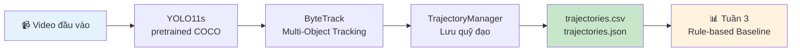

# Tuần 2: YOLO11 Detection + ByteTrack + TrajectoryManager

> **Thời gian:** 08/09 – 14/09/2026  
> **Mục tiêu:** Detection + Tracking chạy được trên video mẫu, output ra trajectory cơ bản.  
> **GPU dùng:** ~5h Kaggle T4 (nhẹ — không có training)

---

## Tổng quan



---

## Cấu trúc file tuần này

| File | Mô tả |
|------|-------|
| [`notebooks/02_detection_tracking.ipynb`](../notebooks/02_detection_tracking.ipynb) | Notebook chạy trên Kaggle — toàn bộ pipeline tuần 2 |
| [`src/tracking/trajectory_manager.py`](../src/tracking/trajectory_manager.py) | Class `TrajectoryManager` — module cốt lõi |
| [`scripts/run_tracking.py`](../scripts/run_tracking.py) | Script CLI để chạy tracking từ terminal |
| [`scripts/visualize_trajectory.py`](../scripts/visualize_trajectory.py) | Script tạo video demo với trajectory |
| [`configs/bytetrack_custom.yaml`](../configs/bytetrack_custom.yaml) | Cấu hình ByteTrack cho giao thông VN |

---

## Ngày 1-2: Object Detection với YOLO11s

### Tại sao YOLO11s?

| Model | Params | mAP COCO | Speed | Dùng khi |
|-------|--------|----------|-------|----------|
| yolo11n | 2.6M | 39.5 | Rất nhanh | Edge, demo |
| **yolo11s** | **9.4M** | **47.0** | **Nhanh** | **✅ Tuần này** |
| yolo11m | 20.1M | 51.5 | Trung bình | Accuracy cao |

**YOLO11s** là lựa chọn tốt nhất cho giai đoạn prototype: đủ chính xác, inference nhanh trên T4.

### Class IDs cần dùng (COCO pretrained)

```python
VEHICLE_CLASSES = [0, 1, 2, 3, 5, 7]

# 0 = person     1 = bicycle   2 = car
# 3 = motorcycle 5 = bus       7 = truck
```

> [!NOTE]
> Sau khi fine-tune (tuần 5), class IDs sẽ đổi về 0–5 theo dataset VN. Tuần này giữ nguyên COCO IDs.

### Chạy detection

```python
from ultralytics import YOLO

model = YOLO("yolo11s.pt")  # tự động download nếu chưa có

# Test detection trên vài frame
results = model.predict(
    source="video.mp4",
    conf=0.4,
    classes=[0, 1, 2, 3, 5, 7],
    imgsz=640,
    save=True
)
```

---

## Ngày 3-4: Multi-Object Tracking với ByteTrack

ByteTrack được tích hợp sẵn trong Ultralytics — không cần cài thêm.

### Tham số tùy chỉnh cho giao thông VN

Xem file cấu hình: [`configs/bytetrack_custom.yaml`](../configs/bytetrack_custom.yaml)

| Tham số | Mặc định | **Tùy chỉnh** | Lý do |
|---------|----------|---------------|-------|
| `track_high_thresh` | 0.5 | **0.4** | Xe máy nhỏ thường có confidence thấp |
| `new_track_thresh` | 0.6 | **0.5** | Khởi tạo track sớm hơn |
| `track_buffer` | 30 | **60** | Giữ track khi xe bị che khuất |
| `track_low_thresh` | 0.1 | 0.1 | Giữ nguyên |
| `match_thresh` | 0.8 | 0.8 | Giữ nguyên |

### Chạy tracking

```python
results = model.track(
    source="video.mp4",
    persist=True,              # giữ track ID liên tục
    tracker="configs/bytetrack_custom.yaml",
    conf=0.4,
    iou=0.5,
    classes=[0, 1, 2, 3, 5, 7],
    stream=True,               # tiết kiệm RAM cho video dài
    verbose=False,
)

for frame_idx, result in enumerate(results):
    if result.boxes.id is not None:
        track_ids = result.boxes.id.cpu().numpy()
        bboxes    = result.boxes.xyxy.cpu().numpy()
        classes   = result.boxes.cls.cpu().numpy()
        confs     = result.boxes.conf.cpu().numpy()
```

> [!TIP]
> Luôn dùng `stream=True` khi chạy tracking trên video. Không dùng stream → load toàn bộ video vào RAM → crash trên video dài.

---

## Ngày 5-7: TrajectoryManager

Module cốt lõi của tuần này. Code đầy đủ tại [`src/tracking/trajectory_manager.py`](../src/tracking/trajectory_manager.py).

### Giao diện (API)

```python
from src.tracking.trajectory_manager import TrajectoryManager

manager = TrajectoryManager(max_history=90)  # 90 frames = ~3s ở 30fps

# Cập nhật mỗi frame
manager.update(frame_id, track_ids, bboxes, classes, confs)

# Truy vấn
traj  = manager.get_trajectory(track_id)      # (T, 2) — [cx, cy] theo thời gian
speed = manager.get_speed(track_id)           # (T-1,) — pixel/frame
accel = manager.get_acceleration(track_id)    # (T-2, 2) — [ax, ay]
dtheta = manager.get_direction_changes(tid)   # (T-2,) — độ lệch góc (°)
ratio  = manager.get_area_ratio(tid)          # (T-1,) — thay đổi diện tích bbox

# Quản lý
active = manager.get_active_tracks()          # tracks đang active
pairs  = manager.get_interacting_pairs()      # cặp tracks gần nhau
manager.cleanup_old_tracks()                  # xóa tracks cũ

# Export (dùng cho Tuần 3+)
manager.export_csv("trajectories.csv")
manager.export_json("trajectories.json")

# Thống kê
print(manager.get_summary())
# {'total_tracks': 47, 'active_tracks': 12, 'avg_track_length': 38.5, ...}
```

### Đặc trưng chuyển động (sẽ dùng Tuần 3)

| Đặc trưng | Method | Công thức | Ý nghĩa khi phát hiện tai nạn |
|-----------|--------|-----------|-------------------------------|
| Vận tốc | `get_velocity()` | `v(t) = center(t) − center(t−1)` | Tốc độ cơ bản |
| Tốc độ | `get_speed()` | `‖v(t)‖` | Giảm đột ngột → phanh gấp |
| Gia tốc | `get_acceleration()` | `a(t) = v(t) − v(t−1)` | Đột biến âm lớn → va chạm |
| Góc lệch | `get_direction_changes()` | `Δθ = θ(t) − θ(t−1)` | `>45°` → xe bị văng |
| Diện tích | `get_area_ratio()` | `area(t)/area(t−1)` | Thay đổi đột ngột → xe lật |
| IoU | `compute_iou(bbox_a, bbox_b)` | Giao/Hợp 2 bbox | `>0.15` → 2 xe chồng nhau |

---

## Workflow Kaggle

### Bước 1: Tạo Notebook

1. Vào [kaggle.com/code](https://www.kaggle.com/code) → **New Notebook**
2. Đặt tên: `week2-detection-tracking`
3. Settings → **Accelerator: GPU T4 x2** (hoặc P100)
4. Copy code từ [`notebooks/02_detection_tracking.ipynb`](../notebooks/02_detection_tracking.ipynb)

### Bước 2: Upload video mẫu

**Option A:** Tạo Kaggle Dataset từ video của bạn:
- Vào [kaggle.com/datasets](https://www.kaggle.com/datasets) → **New Dataset**
- Upload video → mount vào notebook: `/kaggle/input/<tên-dataset>/`

**Option B:** Tải từ dataset đã có (CCD/CADP):
```python
# CCD dataset đã có trên Kaggle
# https://www.kaggle.com/datasets/asmjamil/car-crash-dataset-ccd
VIDEO_PATH = '/kaggle/input/car-crash-dataset-ccd/videos/sample.mp4'
```

### Bước 3: Chạy và lưu kết quả

```bash
# Trong notebook cell — chạy script CLI
!python scripts/run_tracking.py \
    --video /kaggle/input/your-dataset/sample.mp4 \
    --output-dir /kaggle/working/week2_output \
    --save-video
```

Sau khi chạy xong:
- Click **"Save Version"** → **"Save & Run All (Commit)"** → notebook chạy background
- Sau khi commit xong, vào **Output tab** → tải về hoặc tạo Kaggle Dataset

### Bước 4: Sync về Google Drive

**Từ Kaggle Output:** Download file từ Output tab → upload thủ công lên Drive

**Qua rclone (tự động):**
```bash
# Setup rclone 1 lần
!curl https://rclone.org/install.sh | sudo bash -q
# Chạy rclone config, làm theo hướng dẫn để kết nối Drive

# Upload
!rclone copy /kaggle/working/week2_output/ \
    gdrive:accident_detection/results/week2_output/ \
    --progress
```

### Cấu trúc Drive sau tuần 2

```
MyDrive/accident_detection/
├── datasets/           ← từ Tuần 1
└── results/
    └── week2_output/   ← mới tạo tuần này
        ├── detection_preview.png
        ├── speed_analysis.png
        ├── tracking_raw.json
        ├── trajectories.csv        ← input cho Tuần 3
        ├── trajectories.json       ← input cho Tuần 3
        ├── tracking_summary.json
        └── trajectory_visualization.mp4
```

---

## Chạy từ local (tùy chọn)

Để test nhanh trên máy trước khi đưa lên Kaggle:

```bash
# Cài dependencies
pip install ultralytics opencv-python

# Chạy tracking
python scripts/run_tracking.py \
    --video demo/sample_videos/sample_traffic.mp4 \
    --output-dir results/week2_output \
    --conf 0.4 \
    --save-video

# Tạo video trajectory visualization
python scripts/visualize_trajectory.py \
    --video demo/sample_videos/sample_traffic.mp4 \
    --tracks results/week2_output/trajectories.json \
    --output results/week2_output/trajectory_viz.mp4 \
    --tail 30
```

---

## Kết quả mong đợi

| Output | Mô tả | Dùng cho |
|--------|-------|----------|
| `detection_preview.png` | 3 frame với bbox detection | Kiểm tra bằng mắt |
| `speed_analysis.png` | Biểu đồ phân bố tốc độ | EDA chuyển động |
| `trajectory_visualization.mp4` | Video với đường đi từng xe | Demo, kiểm tra tracking |
| **`trajectories.json`** | Toàn bộ trajectory + features | **→ Input Tuần 3** |
| **`trajectories.csv`** | Dạng bảng (Excel/Sheets) | **→ Phân tích, EDA** |

---

## Checklist Tuần 2

- [ ] YOLO11s pretrained chạy được trên video mẫu
- [ ] ByteTrack tracking: mỗi xe có track ID nhất quán
- [ ] `TrajectoryManager` class hoàn chỉnh (`src/tracking/trajectory_manager.py`)
- [ ] Phân tích velocity / acceleration / direction change
- [ ] Video demo với bounding box + trajectory
- [ ] Export `trajectories.csv` + `trajectories.json`
- [ ] Sync kết quả lên Google Drive

---

## Lưu ý kỹ thuật

> [!WARNING]
> **Không dùng COCO IDs sau khi fine-tune.** Sau tuần 5, model sẽ được fine-tune với dataset VN và class IDs sẽ thay đổi (0–5). Cần cập nhật `target_classes` tương ứng.

> [!TIP]
> **Smoothing trước khi tính đặc trưng.** TrajectoryManager có method `smooth_trajectory(window=5)` để giảm nhiễu detection jitter. Luôn smooth trước khi tính velocity/acceleration để kết quả chính xác hơn.

> [!NOTE]
> **GPU quota.** Tuần này chỉ dùng ~5h GPU Kaggle. Tracking nhẹ hơn nhiều so với training. Video 60s chạy trong ~2 phút trên T4.

---

*Tuần trước: [Tuần 1 — Setup & EDA](tuan-1-setup-eda.md) | Tuần tiếp: [Tuần 3 — Rule-Based Baseline](tuan-3-rule-based-baseline.md)*
